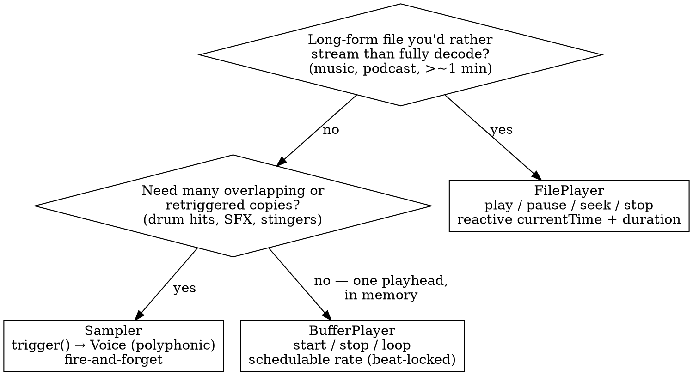

# Choosing a playback primitive

`@audiorective/core` ships three ways to play audio: **`Sampler`**, **`BufferPlayer`**, and **`FilePlayer`**. They are not interchangeable — picking the wrong one shows up as subtle bugs (loops that drift off the beat, a rate you can't automate, a 60-minute file decoded into memory). This guide picks the right one.

All three are output-only `AudioProcessor`s: they expose `output` and `params.volume`, and you compose EQ / `Spatial` / routing downstream (`player.output → … → ctx.destination`). The full API for each is in `core.md`.

## The two axes

Every choice comes down to two independent questions:

1. **Source** — is the audio an in-memory `AudioBuffer` (you decoded it up front) or a streamed file (an `HTMLAudioElement` pulls it progressively, no full decode)?
2. **Voice model** — do you fire **many overlapping** copies (polyphonic), or drive **one moving playhead** (single)?

That yields the lineup. Three of the four combinations are real primitives; the only empty cell is **polyphonic over a streamed source** — overlapping a live download is nonsensical.

|                     | In-memory `AudioBuffer` | Streamed file (`HTMLAudioElement`) |
| ------------------- | ----------------------- | ---------------------------------- |
| **Polyphonic**      | `Sampler`               | —                                  |
| **Single playhead** | `BufferPlayer`          | `FilePlayer`                       |

> Live realtime input (microphone, WebRTC, a remote `MediaStream`) is **not** covered by any of these — it's a different category (a non-seekable live faucet, no transport). A dedicated primitive is future work; for now route a `MediaStreamAudioSourceNode` into your graph by hand.

## Decision flow

In words:

1. **Streamed long-form?** (music track, podcast, anything you'd rather not fully decode into RAM) → **`FilePlayer`**.
2. Otherwise, **need overlap / retriggering?** (a hi-hat hit while the last one rings, layered one-shots) → **`Sampler`**.
3. Otherwise — one in-memory source you `start`/`stop`/loop, especially **beat-locked or with pitch/tempo automation** → **`BufferPlayer`**.

## Per-primitive

### `Sampler` — the drum pad

**Use when** you trigger short in-memory samples that may overlap: SFX, percussion, one-shots, stingers, short loops. `trigger()` spawns a `Voice` each call; `polyphony` + `steal` cap the overlap.

**Avoid when** you need a _stable_ transport you schedule against. A `Voice`'s `rate`/`volume` are immediate setters, and the voice recreates its source on `pause`/`seek`/`rate` — so it has no stable `playbackRate` AudioParam to ramp. For a schedulable rate, that's `BufferPlayer`.

### `BufferPlayer` — the deck

**Use when** you have one in-memory source on a single playhead and you need **sample-accurate `start(t0)`** and/or a **schedulable `rate`**: beat-locked loops and stems, vinyl spin-down, tempo-matched transitions, anything that must stay phase-locked to other ctx-clocked sources.

**Avoid when** the source is long enough that decoding it all into an `AudioBuffer` is wasteful (→ `FilePlayer`), or when you want overlapping retriggers (→ `Sampler`).

**Layered "instruments"** (a beat made of several stems) are **N `BufferPlayer`s** sharing one `start(t0)` and ramped together — the primitive stays one buffer; layering is composition.

### `FilePlayer` — the track

**Use when** the source is long-form and streamed: music, podcasts, backing tracks. Single playhead with `play`/`pause`/`seek`/`stop` and reactive `cells.currentTime` / `cells.duration` — built for a scrubber/progress UI.

**Avoid when** you need beat-locking or sample-accurate scheduling. `FilePlayer` runs on the **media clock**, not the AudioContext sample clock, so it can't phase-lock to ctx-clocked sources and its rate/position aren't sample-accurate.

## Quick reference

|                  | `Sampler`                       | `BufferPlayer`                    | `FilePlayer`                               |
| ---------------- | ------------------------------- | --------------------------------- | ------------------------------------------ |
| Metaphor         | Drum pad                        | Deck / tape loop                  | Track                                      |
| Source           | `AudioBuffer`                   | `AudioBuffer`                     | `HTMLAudioElement` (streamed)              |
| Memory           | whole sample resident           | whole sample resident             | low — progressive                          |
| Voices           | polyphonic (overlap)            | one persistent playhead           | one playhead                               |
| Clock            | sample-accurate                 | sample-accurate                   | media clock                                |
| Schedulable rate | no (per-voice immediate setter) | **yes (`params.rate`)**           | no (immediate setter)                      |
| Transport        | none — `trigger()`              | `start`/`stop`/loop               | `play`/`pause`/`seek`/`stop`               |
| Reactive state   | `cells.activeVoices`            | `cells.isPlaying`                 | `cells.isPlaying`/`currentTime`/`duration` |
| Best for         | SFX, hits, one-shots            | beat-locked loops/stems, DJ moves | music, long-form, scrubbing                |

## Common mistakes

- **Using `FilePlayer` for a beat-locked loop.** It can't phase-lock (media clock) and the rate isn't schedulable — loops drift. Use `BufferPlayer`.
- **Using `Sampler` (polyphony 1) for a loop you want to pitch-ramp.** A `Voice` has no stable `playbackRate` AudioParam to schedule. Use `BufferPlayer`, whose `params.rate` is a `SchedulableParam`.
- **Decoding a long track into an `AudioBuffer` for `Sampler`/`BufferPlayer`.** Wasteful in memory and slow to load. Stream it with `FilePlayer`.
- **Reaching for a "track" primitive for a microphone / WebRTC stream.** That's live input, not a transport — no seek/loop/duration. Route the `MediaStreamAudioSourceNode` directly for now.

## See also

`core.md` (full API for each primitive) · `designing-audio-apps.md` (source-per-role, channel strips) · `architecture.md` (audio/UI separation).
